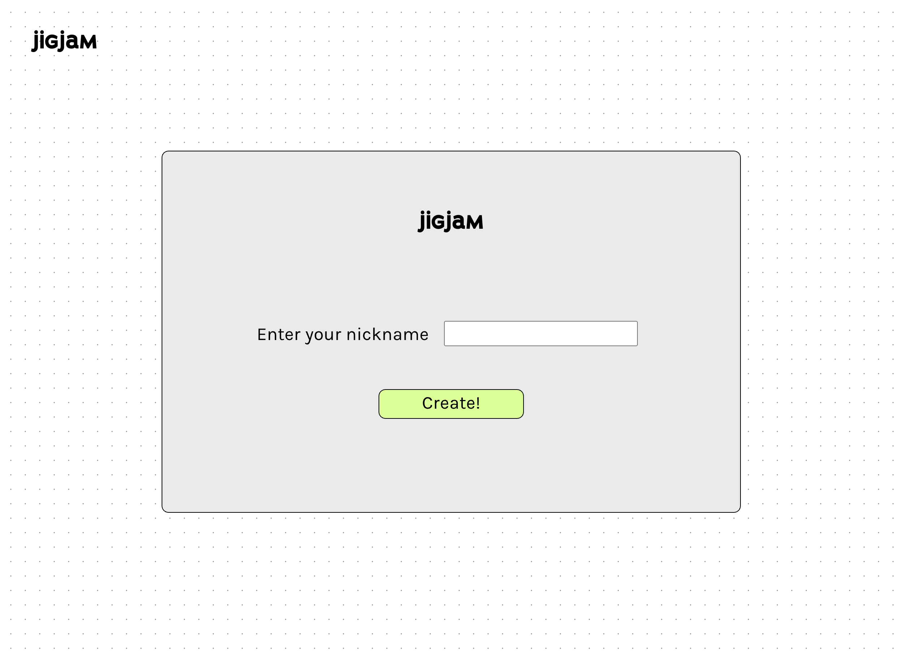
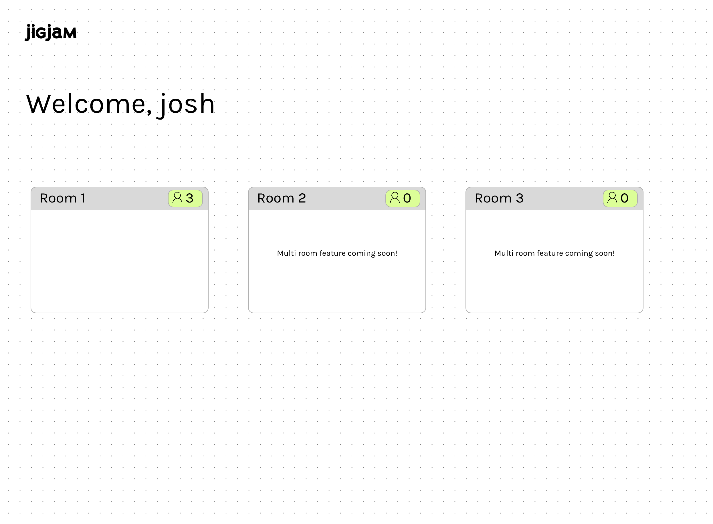
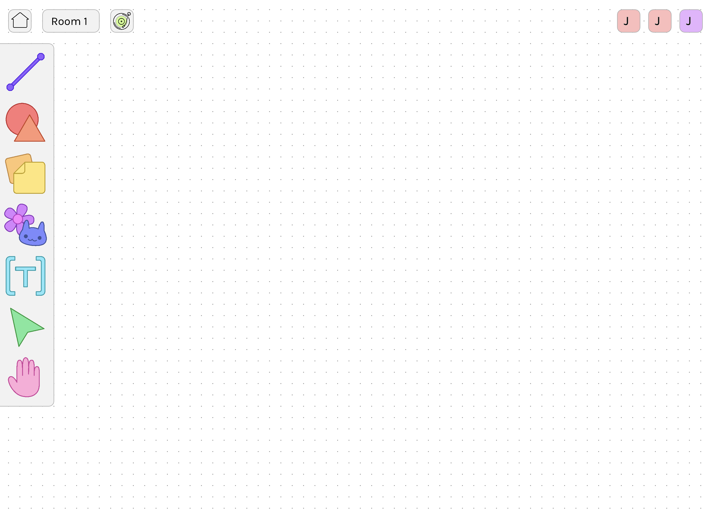
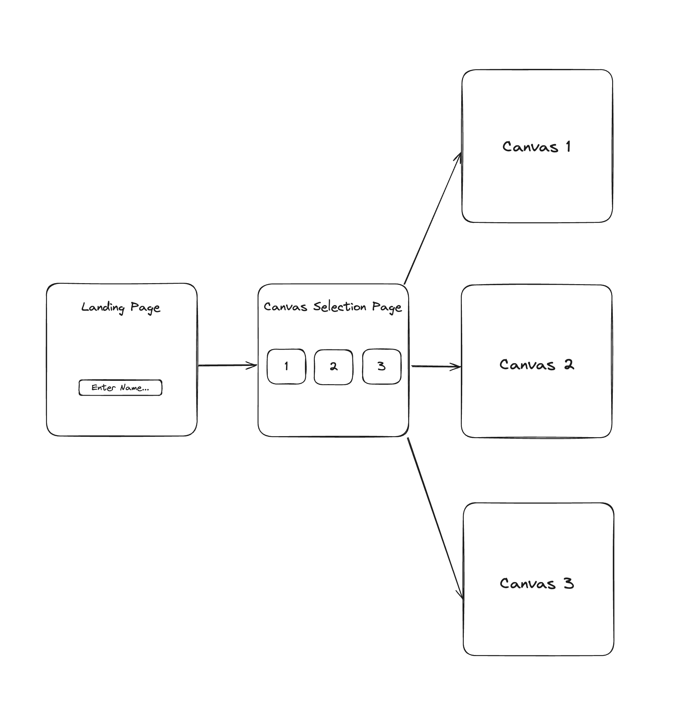
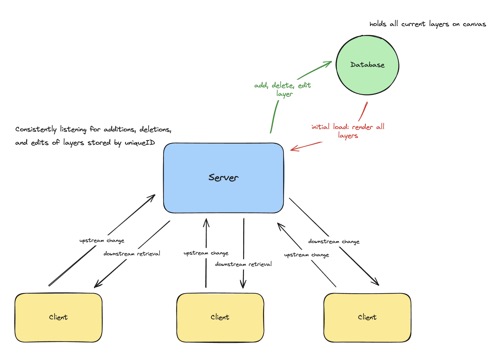

# [JigJam](https://jigjam.live)

## 🗺️ Overview
Figma’s collaborative whiteboard platform. There are many features that FigJam offers, but we decided to focus on a few canvas/graphics tools and implemented them to work in a multi-user experience. FigJam has become an essential tool for real-time brainstorming, visualizing, and collaborating (especially in developing this project), so we thought it would be a fun challenge to recreate!
Our remake is called JigJam. It is a multi-user whiteboard where users can collaboratively add, delete, and modify graphics on a canvas in real-time. When first opening JigJam, users are prompted to enter their name. Users then advance to the home screen with options for different “rooms” or canvases to edit (work in progress currently; only one room is available). Once selecting a room, users will advance to the multi-user canvas.  

## 📽️ Video Demo

https://github.com/joshle298/JigJam/assets/59464508/d1d66b4f-0bcb-4af5-a927-fce83f7f46e7

# 📍 Milestone 1

## Data Model

The application will store the layers created on the canvas - allowing for restoring the current state of the global canvas

* Layers contain all attributes needed to render onto clients' canvases
  * uniqueID: generated uuid -> `String`
  * graphicType: Sticky, Line, Shape, Sticker, Text -> `String`
  * x: x position on the canvas -> `Number`
  * y: y position on the canvas -> `Number`
  * s: scale of the layer -> `Number`
  * author: who created the layer -> `String`
  * text (optional): for text layer type -> `String`
  * color (optional): rgb value of color -> `String`
  * ...
* Each layer in the database should be dynamically deleted/added depending on client interaction

An Example Layer:

```javascript
{
  uniqueID: "5bf1afbb-8765-4ce7-b0c9-8fd337cc93ae",
  graphicType: "Sticky",
  x: 43.983,
  y: 10.024,
  s: 2.051,
  author: "Joshua Le",
  text: "Hello JigJamers!",
  color: "rgb(178,34,34)"
}
```

## [Link to Commented First Draft Schema](db.mjs)

## Wireframes

/home



/home (once user submits name)



/home (once user enters a canvas)



## Site map




## System Design



## User Stories or Use Cases

1. as a user, I can enter a display name for myself
2. as a user, I can choose from one of three global canvases
3. as a user, I can see all previously created designs, ideas, and creativity from all users that preceeded me
4. as a user, I can freely express my own designs and ideas on the canvas using the tools at my disposal (lines, shapes, sticky notes, stickers, text)
5. as a user, I can edit all layers on the canvas (resizing, editing the color, changing the thickness, etc.)
6. as a user, I can see all other live users in the canvas creating and moving in real-time
7. as a user, I can change the music that is playing
8. as a user, I can save the current state of the canvas via a .png export

## Research Topics

* (6 points) Differential Synchronization
    * There are many cases in which two or more users are simulatenously editing the same layer
    * Many real-time applications deal with this issue today: Google Docs, Figma, Microsoft Suite Products, etc.
    * Google published how they resolve this issue as well as pose other solutions [here](https://neil.fraser.name/writing/sync/)
* (4 points) Load Balancing & Performance Optimizations
    * Sending over constant data of deleting, adding, and editing layers across multiple users can eventually overload the server
    * To mitigate this, using Socket.io's Node.js clusters can help with performance issues when many users are connected
    * Also known as [sticky load balancing](https://socket.io/docs/v4/using-multiple-nodes#using-nodejs-cluster) as per Socket.IO docs
    * [Performance Tuning](https://socket.io/docs/v4/performance-tuning/)

10 points total out of 8 required points

## [Link to Initial Main Project File](app.mjs)

## Annotations / References Used

1. [p5.js docs](https://p5js.org/reference/) - [sketch.js](./public/sketch.js): used for custom graphic/layer tools + canvas

# 📍 Milestone 2

## AJAX w/API Endpoints (2 Forms)

* [`api/room/join`](https://github.com/joshle298/JigJam/blob/a78544423400787e43d6cac665394dd38a96fa68/public/sketch.js#L129)
* [`api/user/create`](https://github.com/joshle298/JigJam/blob/a78544423400787e43d6cac665394dd38a96fa68/public/sketch.js#L101)

### POST/GET API & DATA (MongoDB) Demo

https://github.com/joshle298/JigJam/assets/59464508/b20a5cfe-5a9e-4ab9-ad2f-2ac3d704e3dc

## [Progress on Differential Synchronization Research Topic](https://github.com/joshle298/JigJam/blob/a78544423400787e43d6cac665394dd38a96fa68/db.js#L30)

# 📍 Milestone 3


# Miscellaneous (not related to AIT project guidelines)
## 🛠️ Todo
- [x] Migrate hosting to AWS, Google Cloud, or Heroku (and publish to JigJam's official domain)
- [ ] Save state for all tools (only line implemented - weights)
- [ ] Multi-Canvas experience
- [ ] Google-authentication login for users
- [ ] # of users in canvas and who
- [ ] Live cursor tracking
- [ ] Storing the current state of canvases for new users
- [ ] More tools!
- [ ] Commenting
- [ ] And so much more!!

## 🌐 Running Local Instance of JigJam
1. `npm install` (only do once globally)
2. `npx nodemon server.js`
3. Navigate to `localhost:3000`
